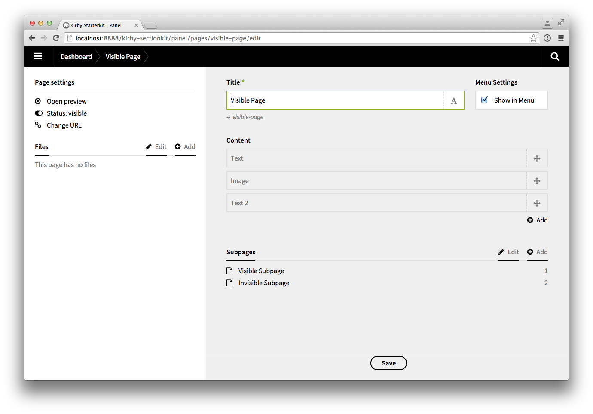

# Kirby Sectionkit

This is a modified version of Kirby's [Starterkit](https://github.com/getkirby/starterkit) which uses pages as 

+ subpages and 
+ content elements/sections (as described [here](http://getkirby.com/docs/solutions/one-pager)) side by side.

## Please notice

**It's kind of a playground, so feel free to use it as a starting point and to play around with it. Any ideas, suggestions or improvements are welcome.**

## Documentation 

At the moment the whole stuff is rather undocumented. But here are some facts I think you should know:

+ The content type (blueprint) Page is used for pages
+ All content types starting with _ are used for sections
+ Pages are always visible (to keep the subpage overview clean)
+ Sections are always invisible (see above)
+ The visibility of pages and sections is handled automatically by [hooks](http://getkirby.com/docs/panel/developers/hooks)
+ The order of the sections is stored as yaml list inside a custom field called **contentlist** heavily based on [Tim Oetting's list field](https://github.com/TimOetting/kirby-list-field) – maybe one day there will be a seperate repo for it.
+ On multilanguage sites the order of the sections is handled in the default language
+ The list of the subpages is realized with the [subpagelist](https://github.com/flokosiol/kirby-subpagelist/) field

## Download with git

    git clone --recursive https://github.com/flokosiol/kirby-sectionkit.git

## Kirby

If you've read the whole text until here, I think you know what Kirby is. Otherwise: [Kirby](http://getkirby.com) is a file-based CMS.
Easy to setup. Easy to use. Flexible as hell.

## Buy a license

You can purchase your Kirby license at
<http://getkirby.com/buy>

A Kirby license is valid for a single domain. You can find
Kirby's license agreement here: <http://getkirby.com/license>
